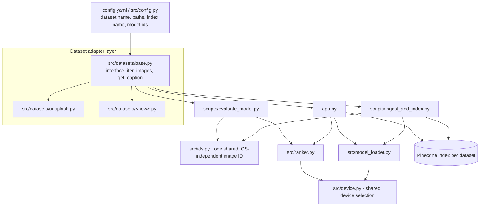

# System Architecture & Phase-wise Roadmap

**Project:** Zero-Shot Vision Search, retargeted to a new dataset
**Repo:** `origin` → github.com/Saurabhgithub1006/Zero-Shot-Vision-Search · `upstream` → github.com/Tekraj15/zero-shot-vision-search
**Created:** 2026-10-04
**Status:** Phases 0–7 implemented and validated on 2026-10-08 (see section 8). Dataset: **A2D2** (Audi, CC BY-ND 4.0).

---

## 1. What the system does

Text-to-image semantic search. A user types a natural-language query, and the system returns the most relevant images from a dataset. No classifier is trained for this. Matching works because SigLIP embeds images and text into the same vector space.

## 2. Current architecture (as cloned)

```mermaid
graph TD
    subgraph Offline ingestion
        DL[scripts/download_images.py] -->|Unsplash URLs from photos.csv000| IMG[assets/image-dataset/*.jpg]
        IMG --> ING[scripts/ingest_and_index.py]
        ING -->|image embedding 1152-d| ML[src/model_loader.py · SigLIP so400m-patch14-384]
        ING -->|upsert id=md5 of rel path, metadata path+filename| PC[(Pinecone index 'vision-scout')]
        ING --> META[data/metadata.json]
    end

    subgraph Online query
        U[User] --> APP[app.py · Streamlit]
        APP -->|text embedding| ML
        APP -->|top-50 cosine| PC
        APP -->|query vs image caption| RR[src/ranker.py · ms-marco-MiniLM cross-encoder]
        CSV[photos.csv000 captions] --> APP
        RR -->|top-12| APP
        APP -->|reads image file| IMG
    end

    subgraph Evaluation
        EV[scripts/evaluate_model.py] -->|caption as query, own image as target| PC
        EV --> RR
        EV -->|Recall@1/5/10, MRR| OUT[console]
    end
```

| Component | File | Role |
|---|---|---|
| Model loader | `src/model_loader.py` | Singleton SigLIP. L2-normalised image and text embeddings (1152-d) |
| Vector index | `src/vector_indexer.py` | Pinecone serverless (aws/us-east-1), cosine. Creates the index if it doesn't exist |
| Re-ranker | `src/ranker.py` | Cross-encoder scoring of (query, image caption) pairs |
| Utils | `src/utils.py` | Image discovery and metadata JSON I/O |
| Ingestion | `scripts/ingest_and_index.py` | Embeds images, skips IDs already indexed, upserts in batches of 100 |
| Evaluation | `scripts/evaluate_model.py` | Uses each image's caption as a query and checks where that image ranks |
| UI | `app.py` | Streamlit search page with a 3-column result grid |

**Dataset coupling.** The current code assumes these things about the dataset:
1. Images are in `assets/image-dataset/`, and each file name (without extension) equals the CSV `photo_id`.
2. Captions come from a tab-separated CSV with columns `photo_id`, `ai_description` and `photo_description`.
3. The CSV path is written directly into 3 files. The Pinecone index name (`vision-scout`) is also written directly into the code.

## 3. Findings from investigation (evidence ledger)

| ID | Where | Finding | Type |
|---|---|---|---|
| E1 | `requirements.txt:1` | `torch==2.4.1` can't be installed on this machine's Python 3.13. `pip index versions torch` lists 2.6.0 as the oldest available version | [observed] |
| E2 | local env | GPU is an RTX 5060 Laptop (8 GB, Blackwell), which needs a cu128 build of torch. `torch 2.11.0+cu128` is already installed globally | [observed] |
| E3 | `scripts/ingest_and_index.py:63` vs `scripts/evaluate_model.py:131` | On Windows, ingestion hashes `assets\image-dataset\x.jpg` but evaluation hashes `assets/image-dataset\x.jpg`. The IDs never match, so every metric would come out as **0** on Windows | [observed: reproduced the hash mismatch in Python] |
| E4 | repo root | There is no `.gitignore`, so `.env` (which will hold `PINECONE_API_KEY`), `data/` and downloaded images could get committed by accident | [observed] |
| E5 | `app.py:66`, `scripts/evaluate_model.py:21`, `scripts/download_images.py:84` | Dataset paths are duplicated across 3 files | [read] |
| E6 | `src/model_loader.py:21-25`, `src/ranker.py:12-16` | The device-selection logic is copied in two places | [read] |
| E7 | `app.py:61-75`, `scripts/evaluate_model.py:48-63` | Caption loading is implemented twice | [read] |
| E8 | `src/ranker.py:38`, `app.py:101` | If an image has no caption, the cross-encoder compares the query to `""`. Re-ranking then becomes meaningless and can push *good* vector matches down | [read] → HYPOTHESIS until measured in Phase 5 |
| E9 | `README.md` | Refers to `assets/model_eval_metrics.png`, which isn't in the repo | [observed] |
| E11 | `src/model_loader.py` (found 2026-10-06) | With transformers 5.x, `get_image_features` / `get_text_features` return `BaseModelOutputWithPooling` instead of a tensor, so every embedding failed (`'BaseModelOutputWithPooling' object has no attribute 'norm'`) | [observed] |
| E10 | `scripts/evaluate_model.py:126-129` | The target file name defaults to `.jpg` and falls back to a prefix scan of the directory for each sample, which is O(N) per query | [read] |

---

## 4. Target architecture

The goal is that **switching datasets means changing one config file and one adapter, not editing code in many places.**



New or extracted modules. Each one has a single job and its own unit test:

| Module | Responsibility | Fixes |
|---|---|---|
| `src/config.py` (+ `config.yaml`) | Single source of truth for paths, index name, model ids and top-k values. Secrets are read from the environment only | E5 |
| `src/ids.py` | `image_id(path)`: POSIX-normalised relative path, then md5 | E3 |
| `src/device.py` | `select_device()`: CUDA, then MPS, then CPU | E6 |
| `src/datasets/` | Adapter interface plus one adapter per dataset (captions, IDs, file lookup) | E7, E10 |
| Ranker gate | Skip re-ranking, or fall back to the vector score, when a candidate has no caption | E8 (if confirmed) |

---

## 5. Phase-wise roadmap

Every phase gets its own change ID and follows the same cycle: **plan → your approval → implement → validate → your run → commit → changelog + audit**. The tree must work after every phase.

### Phase 0: Environment & repo hygiene · `CHG-20261004-01`
| | |
|---|---|
| Goal | Get the existing project to install and import on this machine, safely |
| Steps | Add `.gitignore` (`.env`, `data/`, `assets/image-dataset/`, `__pycache__/`, `.venv/`). Add `.env.example` (`PINECONE_API_KEY=`). Create a project virtualenv. Update the torch pin to match D2. You add your Pinecone key to `.env` yourself |
| Verify | `python -c "import torch; print(torch.cuda.is_available())"` prints `True`. All `src` modules import. `git status` doesn't show `.env` |
| Risk | Low |
| Blocks on | D2 |

### Phase 1: Shared modules & config extraction · `CHG-20261004-02`
| | |
|---|---|
| Goal | Remove duplicated code and hardcoded dataset paths (E5, E6, E7) without changing behaviour |
| Steps | Add `src/config.py`, `src/device.py`, `src/ids.py` and `src/datasets/base.py` + `unsplash.py`. Rewire `app.py` and the scripts to use them |
| Verify | Unit tests for each new module. Scripts run `--help` / dry-run without errors. Same IDs as before on POSIX paths |
| Risk | Medium (touches every entry point) |

### Phase 2: Fix the Windows ID mismatch · `CHG-20261004-03`
| | |
|---|---|
| Goal | Make evaluation and ingestion produce the same ID on every OS (E3) |
| Steps | Both scripts use `ids.image_id()` |
| Verify | Regression test that fails on the old code (the backslash path) and passes on the new |
| Risk | Low. Note: any vectors already indexed under backslash IDs would need re-indexing. None exist yet |

### Phase 3: New dataset adapter · `CHG-20261004-04`
| | |
|---|---|
| Goal | Plug in the new dataset |
| Steps | Write `src/datasets/<new>.py` (ID ↔ file ↔ caption mapping). Add a download/prepare script if needed. Add a config entry |
| Verify | The adapter test counts images and captions. Spot-check 10 random ID → file → caption triples |
| Risk | Medium (depends on the dataset's format) |
| Blocks on | D1 |

### Phase 4: Ingest & index · `CHG-20261004-05`
| | |
|---|---|
| Goal | Embed the new dataset and upload it to Pinecone |
| Steps | Run ingestion on a 200-image subset first, then the full set. Use a dataset-specific index or namespace (D3) |
| Verify | Pinecone vector count equals the number of images. Re-running skips everything (idempotent). Note throughput in images/s on the RTX 5060 |
| Risk | Medium (cost and Pinecone free-tier limits; see D3) |

### Phase 5: Evaluate & tune · `CHG-20261004-06`
| | |
|---|---|
| Goal | Baseline quality numbers on the new dataset, and test hypothesis E8 |
| Steps | Run eval with a fixed seed. Compare **vector-only vs re-ranked** Recall@1/5/10 and MRR. Apply the ranker gate if E8 is confirmed |
| Verify | Results table committed to `artifacts/`. The re-ranker stays only if it improves MRR |
| Risk | Low |

### Phase 6: App adaptation & smoke test · `CHG-20261004-07`
| | |
|---|---|
| Goal | The Streamlit app serves the new dataset |
| Steps | Dataset name in the title, example queries suited to the domain, caption shown under each result |
| Verify | `streamlit run app.py`. 5 hand-written queries return relevant results. Screenshot saved to `assets/` |
| Risk | Low |

### Phase 7: Documentation & release · `CHG-20261004-08`
| | |
|---|---|
| Goal | README describes *your* project |
| Steps | New dataset section, setup steps (venv, `.env`), eval results, credit to the upstream author (D5) |
| Verify | Fresh-clone walkthrough works by following the README alone |
| Risk | Low |

---

## 6. Decisions (resolved 2026-10-06)

> Resolution: D1 = **A2D2** (chosen by user after a license review; Cityscapes was excluded because its terms require a scientific affiliation, CoVLA because it is academic/non-commercial only and recorded in Japan). D2–D5 = the recommended options below, approved when the user told me to implement.


**D1: Which dataset?** *(blocks Phase 3)*
Tell me what it is and where it is (a local path or a download link), and whether it has text captions.
- With captions → the full pipeline works, including the re-ranker and Recall/MRR evaluation.
- Without captions → search still works. The re-ranker has to be gated (E8), and evaluation needs class labels (for example "a photo of a {label}" as the query) or a small hand-labelled query set.

**D2: Python / torch version** *(blocks Phase 0)*
- Option A: project venv on Python 3.13 with `torch>=2.7` (cu128). Works with your RTX 5060 and matches what's already installed. *Recommended.*
- Option B: Python 3.12 venv. Wider library compatibility, but needs a second Python install.
- The upstream pin `torch==2.4.1` can't be used here (E1, E2).

**D3: Pinecone layout**
- Option A: a new index per dataset (e.g. `vision-<dataset>`). Clean separation, but the free tier allows only a limited number of indexes.
- Option B: one index with a namespace per dataset. Fits within free-tier limits. *Recommended.*
- Option C: replace Pinecone with local FAISS. No account or key, and runs offline. This is a larger change and differs from upstream.

**D4: Unsplash data in the repo**
The 8.8 MB `photos.csv000` and its docs aren't needed for the new dataset. Keep them (the Unsplash adapter stays usable), or move them out. Nothing will be removed without your explicit go-ahead.

**D5: Upstream credit**
The README is the original author's. Keep a "Based on Tekraj15/zero-shot-vision-search" credit line? *Recommended* (the upstream repo has no LICENSE file, so attribution is the respectful minimum).

---

## 7. Working rules for this project

- Secrets: you add `PINECONE_API_KEY` to `.env` yourself. It never goes into code, commits or chat.
- Nothing is deleted without your specific per-operation approval. A reversible option is always offered.
- Commits: conventional single-line subject, unwrapped body, **no AI attribution or co-author trailers.** Committing and pushing are separate approvals.
- Every change is recorded in `artifacts/changelogs.md` and `artifacts/audit.md` (append-only).

---

## 8. Implementation status (2026-10-08)

| Phase | Change ID | Status | Evidence |
|---|---|---|---|
| 0 Environment & hygiene | CHG-20261006-01 | ✅ Done | `.gitignore`, `.env.example`, venv with torch 2.11 + cu128 and `cuda=True` |
| 1 Shared modules | CHG-20261006-02 | ✅ Done | `src/config.py`, `device.py`, `ids.py`, `datasets/`, `search.py`, `evaluation.py` |
| 2 Windows ID fix | CHG-20261006-03 | ✅ Done | Regression test `tests/test_ids.py` |
| 2b transformers 5.x fix | CHG-20261006-03 | ✅ Done | Embeddings match the model's forward-pass `image_embeds` / `text_embeds`. Regression test `tests/test_model_loader.py` |
| 3 A2D2 adapter | CHG-20261006-04 | ✅ Done | 1,978 frames, 23 scenes, labels from the masks |
| 4 Ingest & index | CHG-20261006-04 | ✅ Done | Pinecone `zero-shot-vision` / namespace `a2d2`: 1,978 vectors. A re-run skips all 1,978 |
| 5 Evaluate | CHG-20261006-05 | ✅ Done | Mean Precision@10 0.79 vs base rate 0.27 (`artifacts/eval_a2d2.json`) |
| 6 App + REST API | CHG-20261006-05 | ✅ Done | Live API: all endpoints and error cases pass. Streamlit AppTest: 12 images, filter works |
| 7 Docs | CHG-20261006-06 | ✅ Done | README, changelog, audit |

**Open follow-ups**
- "Utility vehicle" query scores 0.00 Precision@10. Investigate query wording and prompt ensembling.
- Caption re-ranking is unused for A2D2. Options: generate captions locally with an open-licensed VLM, or re-rank using the labels.
- The transformers deprecation warning for `use_fast` (switch to `backend="torchvision"`).
